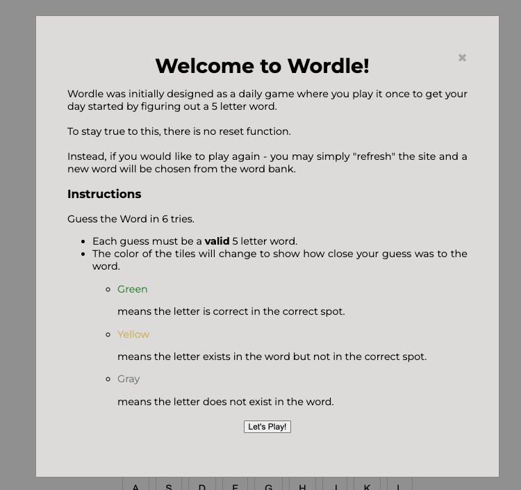
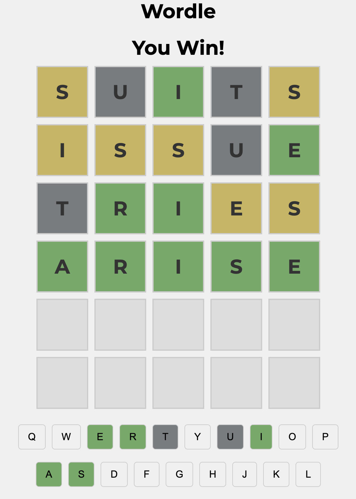

# Rani's Wordle Game

**Project Info**

Welcome to **Rani's Wordle Game**, a comprehensive project that seeks to explore and encapsulate the vast array of knowledge I've acquired in _unit 1_ of **General Assembly**.

## Knowledge Acquired

The code I will be developing will incorporate a range of concepts, including but not limited to:

- Control Flow
- JavaScript Functions
- Scope Management
- Arrays and Objects in JavaScript
- CSS Styling
- MDN Documentation Resources
- DOM Events
- Array Iterator Methods
- Web Accessibility
- Flexbox Layouts
- Markdown Formatting
- API Integration

## Libraries

The currently libraries I will be working on are:

- [Dictionary](https://dictionaryapi.dev/) : This will allow for me to pull a list of words along with the definitions.

## Project Outline

<u>**MVP**</u>

Wordle where you have 6 chances in guessing a 5 letter word. Ideally you are not able to just type in non-dictionary words to fill.

**Stretch Goals**

1. Create [Quordle](https://www.merriam-webster.com/games/quordle/#/). Where you are able to have 4 inputs guessing 4 different words at the same time.
2. Create a way where you are not limited to just a 5 letter word, maybe go 6 or 7 letter words.
3. Use an API instead of creating a word bank of listed words to pull from.
4. Even if they guess wrong, a definition of the word they guess pops up in the bottom. i.e. "swore" - definition: make a solemn statement or promise undertaking to do something or affirming that something is the case.
